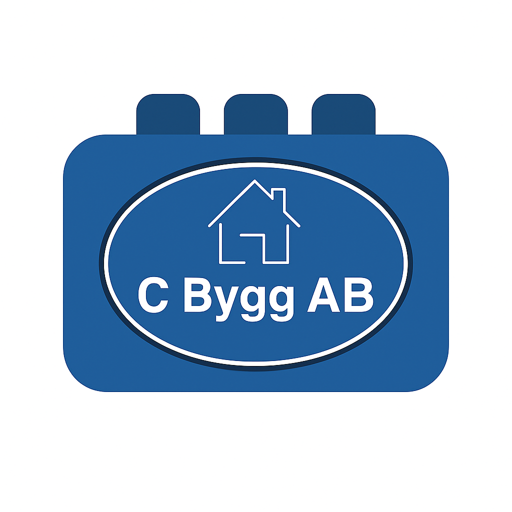
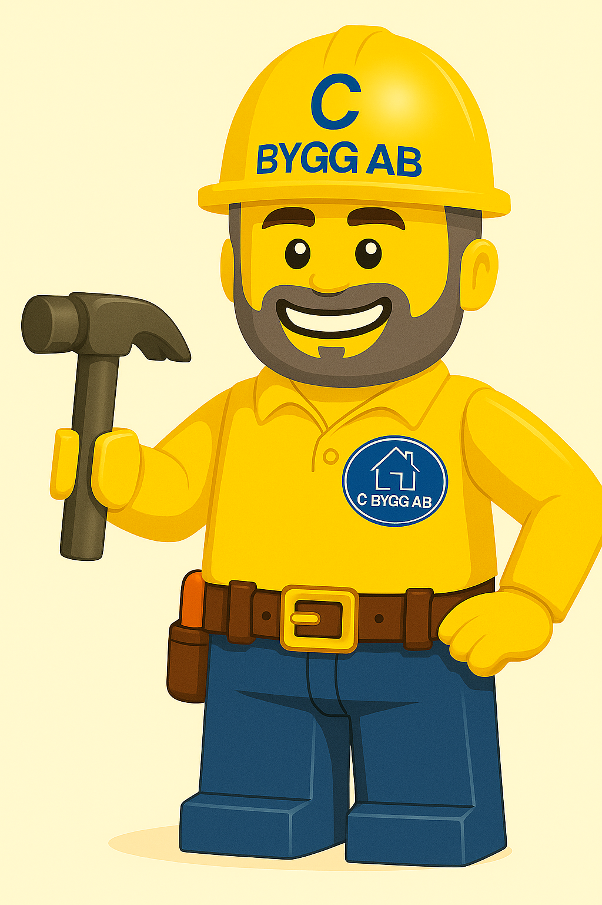

  

  

# 🧱 C Bygg AB – LEGO-stil byggfirma

En kreativ och modern webbplats för **C Bygg AB**, en byggfirma i Göteborg som erbjuder allt inom:
- Tak, utbyggnad och trädäck  
- Garage, renovering och vattenskador  
- Helhetslösningar för både privatpersoner och företag  

Webbplatsen är designad i en unik **LEGO-stil** för att skapa en lekfull men professionell känsla.  
Byggd med **HTML, CSS och JavaScript**.

---

### 🌐 Liveversion
🔗 [https://cbygg2025.github.io/Cbyggab-site/](https://cbygg2025.github.io/Cbyggab-site/)

---

### 📁 Struktur
index.html
about.html
offert.html
references.html
services.html
/css/styles.css
/assets/ (bilder och loggor)

---

### 🧰 Teknik
- **HTML5** – grundstruktur  
- **CSS3** – responsiv design och LEGO-stil  
- **JavaScript** – interaktivitet och menysystem  
- **GitHub Pages** – hosting och versionshantering  

---

👷‍♂️ *Utvecklad och underhållen av C Bygg AB (2025).*
